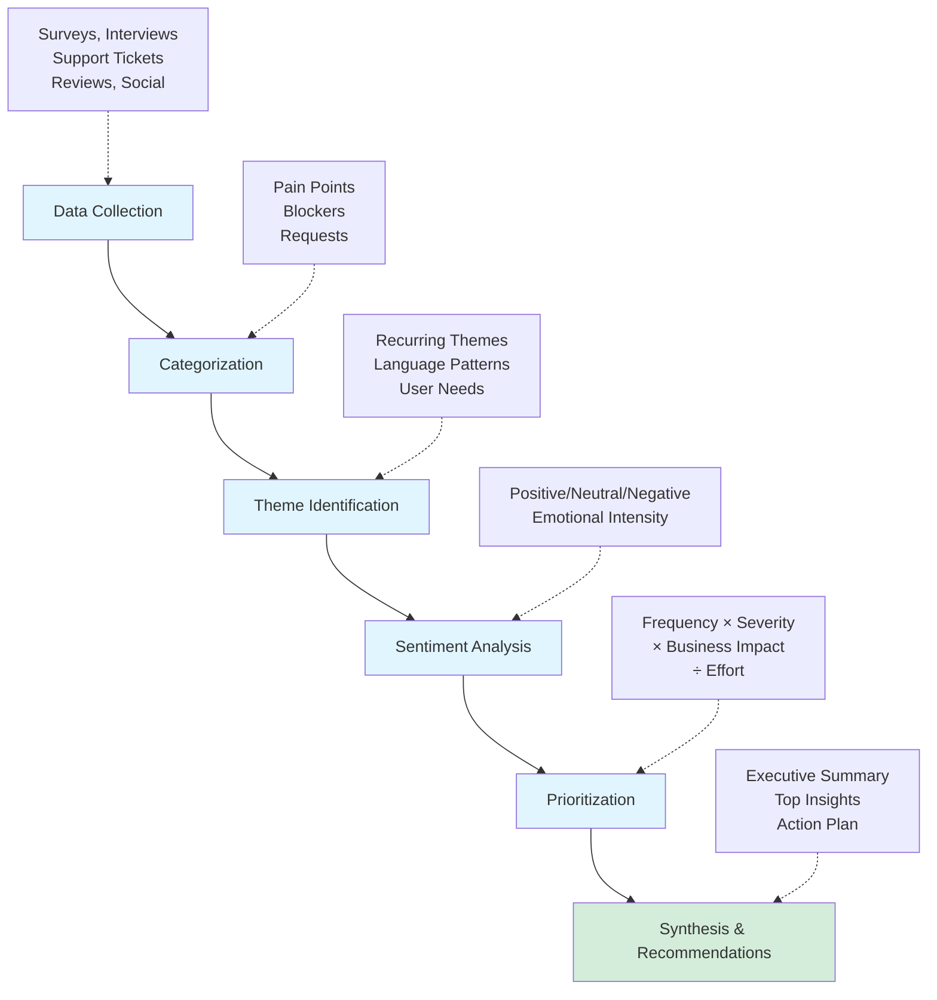

# Customer Feedback Skill 2
 
# Customer Feedback Skill
 
## Skill Metadata
```yaml
name: customer-feedback
version: 1.0.0
category: product-management
tags: [feedback, research, user-interviews, surveys, sentiment-analysis, synthesis]
requires: [read, write, web-search, analysis-tool]
```
 
***
 
## Overview
 
This skill enables Product Managers to process and analyze thousands of customer feedback responses, user interviews, and survey data at scale. Identify patterns, pain points, sentiment, and actionable insights from qualitative and quantitative research data.
 
**Impact**: High | **Time Savings**: Weeks → Hours
 
***
 
## Best Practices
 
### 1. Start with Clear Research Questions
What decisions will this research inform? Align analysis to those questions.
 
### 2. Combine Qualitative and Quantitative
Numbers show frequency, quotes show why. Use both.
 
### 3. Look for Patterns, Not Outliers
One extreme comment isn't a pattern. Focus on recurring themes.
 
### 4. Preserve Context
User quotes are powerful for storytelling. Extract verbatim examples.
 
### 5. Segment Your Analysis
Compare feedback across user types, subscription tiers, tenure, etc.
 
### 6. Balance Frequency and Severity
A rare but critical issue might matter more than a common annoyance.
 
### 7. Close the Loop
Share findings with users who provided feedback. They appreciate being heard.
 
### 8. Track Over Time
Create feedback dashboards to monitor trends quarterly or monthly.
 
***
 
## When to Use This Skill
 
Use this skill when you need to:
- Analyze hundreds or thousands of customer feedback responses
- Process user interview transcripts and identify themes
- Synthesize survey results (open-ended responses)
- Extract sentiment from customer reviews or support tickets
- Identify priority pain points and feature requests
- Generate user persona profiles from research data
- Create executive summaries of research findings
- Track feedback trends over time
 
***
 
## Capabilities
 
### Core Functions
- Categorize feedback into themes (pain points, blockers, requests, solutions)
- Extract sentiment and emotional tones from text
- Identify patterns across large volumes of responses
- Surface priority issues based on frequency and severity
- Generate user personas from aggregated research
- Create research summaries with supporting quotes
- Compare feedback across user segments or time periods
- Extract actionable recommendations from insights
 
### Advanced Features
- Multi-language sentiment analysis
- Topic modeling and clustering
- Trend analysis (feedback over time)
- Cohort comparison (free vs paid, new vs returning)
- Quote extraction for storytelling
- Priority scoring (impact × frequency)
- Integration with support tickets, app reviews, NPS surveys
- Automated tagging and classification
 
***
 
## Analysis Framework
 
| Step | Focus | Key Activities | Output |
| --- | --- | --- | --- |
| 1. Data Collection | Gather & organize feedback | Import from surveys, transcripts, support systems, review sites, and social channels | Structured dataset ready for analysis |
| 2. Categorization | Sort by type | Tag feedback as pain points, blockers, feature requests, praise, questions, or bugs | Organized feedback by category |
| 3. Theme Identification | Find patterns | Extract recurring themes, common language patterns, and underlying user needs | Key themes per category |
| 4. Sentiment Analysis | Extract emotion | Classify tone as positive/neutral/negative and measure emotional intensity | Sentiment scores and emotional context |
| 5. Prioritization | Rank insights | Calculate priority using frequency × severity × business impact ÷ effort | Priority-ranked insights |
| 6. Synthesis | Create recommendations | Build executive summary with top insights, user quotes, and action plan | Actionable deliverables |
 

 
### Step 1: Data Collection & Organization
```
Inputs:
- Survey responses (CSV, Google Sheets, Typeform)
- Interview transcripts (text, Zoom transcripts)
- Support tickets (Zendesk, Intercom)
- App reviews (App Store, Google Play)
- Social media mentions (Reddit, Twitter)
- NPS comments
- User feedback forms
```
 
### Step 2: Categorization
```
Bucket feedback into:
1. Pain Points - Current frustrations and problems
2. Blockers - Critical issues preventing use
3. Feature Requests - Desired new functionality
4. Praise - What users love
5. Questions - Confusion or misunderstanding
6. Bug Reports - Technical issues
```
 
### Step 3: Theme Identification
```
For each category, identify recurring themes:
- What patterns emerge?
- What language do users use repeatedly?
- What underlying needs are expressed?
```
 
### Step 4: Sentiment Analysis
```
Extract emotional tone:
- Positive, Neutral, Negative
- Intensity (mild frustration vs. critical blocker)
- Emotional language (excited, frustrated, confused)
```
 
### Step 5: Prioritization
```
Rank insights by:
- Frequency (how many users mentioned it)
- Severity (impact on user experience)
- Business impact (revenue, retention, acquisition)
- Effort to address (quick win vs. major project)
```
 
### Step 6: Synthesis & Recommendations
```
Create actionable output:
- Executive summary
- Top 5-10 insights with evidence
- Recommended actions with priority
- User quotes for storytelling
- Persona updates or refinements
```
 
***
 
## Usage Instructions
 
### Analyze Survey Responses
 
**Prompt Template:**
```
Using the customer-feedback skill, analyze the following survey responses:
 
[PASTE DATA OR FILE PATH]
 
Survey context:
- Question(s) asked: [QUESTION TEXT]
- Respondent count: [NUMBER]
- User segment: [WHO TOOK THE SURVEY]
- Date range: [WHEN COLLECTED]
 
Please:
1. Categorize responses into themes
2. Identify sentiment (positive/neutral/negative)
3. Extract the top 10 most common insights
4. Provide supporting quotes for each insight
5. Recommend actionable next steps based on findings
 
Prioritize insights by frequency and impact.
```
 
### Process Interview Transcripts
 
**Prompt Template:**
```
Analyze these user interview transcripts:
 
[PASTE TRANSCRIPTS OR FILE PATHS]
 
Interview details:
- Participants: [NUMBER AND PERSONAS]
- Focus: [RESEARCH QUESTIONS/TOPICS]
- Date: [WHEN CONDUCTED]
 
Extract:
1. Key pain points mentioned (with frequency)
2. Unmet needs and desired outcomes
3. Workflow and usage patterns observed
4. Feature requests and ideas suggested
5. Emotional reactions and sentiment
6. Verbatim quotes that capture essence of findings
 
Synthesize into: [Executive Summary | Persona Updates | Feature Prioritization Input]
```
 
### Aggregate Multi-Source Feedback
 
**Prompt Template:**
```
Synthesize feedback from multiple sources:
 
Sources:
1. [SOURCE 1: e.g., NPS comments, 500 responses]
2. [SOURCE 2: e.g., Support tickets, 1,200 tickets]
3. [SOURCE 3: e.g., App Store reviews, 300 reviews]
4. [SOURCE 4: e.g., User interviews, 15 transcripts]
 
For each source, identify:
- Primary themes
- Sentiment distribution
- Common language and keywords
 
Then cross-analyze:
- What themes appear across all sources?
- What's unique to each source?
- What are the highest-priority issues?
- What quick wins can we tackle?
 
Output format: Research summary with prioritized recommendations
```
 
### Sentiment Trend Analysis
 
**Prompt Template:**
```
Analyze sentiment trends over time:
 
Data:
- Time period: [START DATE] to [END DATE]
- Data points: [MONTHLY/WEEKLY SNAPSHOTS]
- Metrics: [NPS SCORES, REVIEW RATINGS, SURVEY RESPONSES]
 
[PASTE TIME-SERIES DATA]
 
Analyze:
1. Overall sentiment trajectory (improving/declining)
2. Key events that correlate with changes
3. Specific issues that emerged or resolved
4. User segments with different trends
5. Predictions for next period
 
Visualize trends if possible.
```
 
### Generate User Personas from Research
 
**Prompt Template:**
```
Create user personas based on this research data:
 
[PASTE RESEARCH FINDINGS, SURVEY DATA, INTERVIEW NOTES]
 
For each distinct user type, create a persona including:
- Demographics and role
- Goals and motivations
- Pain points and frustrations
- Behaviors and usage patterns
- Technology proficiency
- Key quote that captures their perspective
- How our product fits their needs
 
Identify: [2-4] primary personas
```
 
***
 
## Examples
 
### Example 1: Reddit Comment Analysis (Real-World Case)
 
**Input:**
```
I've scraped 34,000 Reddit comments about our product (Monday.com) from r/productivity and r/projectmanagement.
 
Analyze these comments and identify:
1. Primary pain points users express
2. Most requested features
3. Comparison themes (vs competitors)
4. Sentiment distribution
5. User archetypes that emerge
 
[FILE: reddit_comments.csv]
 
Prioritize insights that could inform our product roadmap.
```
 
**Expected Output:**
- **Pain Point #1** (mentioned 4,200 times): "Overwhelming number of features makes onboarding difficult"
  - Example quotes: [3-5 representative quotes]
  - Sentiment: Frustrated (moderate)
  - Recommendation: Simplify onboarding flow, create role-based setup
 
- **Feature Request #1** (mentioned 2,800 times): "Time tracking integration with Harvest/Toggl"
  - User segment: Agencies and consultancies
  - Business impact: High (affects purchasing decisions)
  - Recommendation: Prioritize native time tracking
 
[Continue for top 10 insights]
 
### Example 2: NPS Comment Synthesis
 
**Input:**
```
Analyze our NPS survey comments from Q4 2024:
- 2,500 responses
- Question: "What's the primary reason for your score?"
- Scores: 0-10 scale
 
[FILE: nps_q4_2024.csv]
 
Break down by:
- Detractors (0-6): What are their main issues?
- Passives (7-8): What would make them promoters?
- Promoters (9-10): What do they love?
 
Identify themes and quick wins.
```
 
**Expected Output:**
 
**Detractors (18% of responses, n=450)**
- Theme 1: "Too expensive for features used" (35% of detractors)
- Theme 2: "Mobile app crashes frequently" (28%)
- Theme 3: "Poor customer support response time" (22%)
 
**Passives (45%, n=1,125)**
- Theme 1: "Good product, but missing [specific feature]" (41%)
- Theme 2: "Works well but has learning curve" (32%)
 
**Promoters (37%, n=925)**
- Theme 1: "Saves hours every week" (55%)
- Theme 2: "Best [category] tool available" (38%)
 
**Quick Wins**:
1. Address mobile app stability (affects 126 detractors)
2. Improve support response time (affects 99 detractors)
3. Add most-requested feature from passives (could convert 461 users)
 
### Example 3: User Interview Theme Extraction
 
**Input:**
```
Extract themes from these 12 user interviews:
 
Participants: B2B SaaS buyers (Director+ level)
Topic: Decision-making process for selecting tools
Duration: 45 min each
 
[PASTE 12 TRANSCRIPTS]
 
Identify:
1. Buying criteria (what matters most?)
2. Evaluation process (how do they decide?)
3. Objections and concerns
4. Competitive alternatives considered
5. Decision influencers (who else is involved?)
```
 
**Expected Output:**
 
**Buying Criteria** (ranked by frequency):
1. **Integration with existing tools** (11/12 mentioned)
  - Quote: "If it doesn't connect to Salesforce, it's a non-starter" - Director of Ops, E-commerce
 
2. **Onboarding and training support** (10/12)
  - Quote: "We need white-glove onboarding or our team won't adopt it" - VP Product, Fintech
 
3. **Pricing transparency and flexibility** (9/12)
 
**Evaluation Process**:
- Average: 6-8 weeks from awareness to decision
- Steps: Research (2 weeks) → Trial (2-3 weeks) → Stakeholder buy-in (2 weeks) → Procurement (1 week)
- Key milestone: "The demo that sells the executive team"
 
**Objections** (top 3):
1. "Too complex for our team's skill level" (7/12)
2. "Worried about vendor lock-in" (6/12)
3. "Unclear ROI timeline" (5/12)
 
***
 
## Analysis Output Formats
 
### Executive Summary
```markdown
# Customer Feedback Analysis - [Time Period]
 
## Overview
- Responses analyzed: [NUMBER]
- Sources: [LIST]
- Key finding: [ONE-SENTENCE SUMMARY]
 
## Top 5 Insights
1. **[Insight Title]** (mentioned [N] times)
   - Description: [Details]
   - Impact: [High/Medium/Low]
   - Quote: "[Representative quote]"
   - Recommendation: [Action]
 
[Repeat for top 5]
 
## Sentiment Distribution
- Positive: X%
- Neutral: Y%
- Negative: Z%
 
## Recommended Actions
1. [Priority 1 action]
2. [Priority 2 action]
3. [Priority 3 action]
```
 
### Detailed Theme Report
```markdown
# Theme: [Theme Name]
 
## Description
[What this theme represents]
 
## Frequency
- Mentioned by: [N users / X% of respondents]
- Sources: [Where this appeared]
 
## Sentiment
- Overall: [Positive/Neutral/Negative]
- Range: [From mild annoyance to critical blocker]
 
## Representative Quotes
1. "[Quote 1]" - [User persona/role]
2. "[Quote 2]" - [User persona/role]
3. "[Quote 3]" - [User persona/role]
 
## User Segments Affected
- [Segment 1]: [Frequency/severity]
- [Segment 2]: [Frequency/severity]
 
## Business Impact
- Revenue: [Effect on sales, retention, churn]
- User satisfaction: [Effect on NPS, satisfaction scores]
- Operations: [Effect on support load, engineering time]
 
## Recommended Action
[Specific next steps with priority]
 
## Related Themes
- [Link to related insights]
```
 
***
 
## Custom Commands
 
### /analyze-feedback
```markdown
# Command: analyze-feedback
# Description: Analyze customer feedback data and generate insights
 
Analyze customer feedback: $ARGUMENTS
 
Process:
1. Categorize into: pain points, blockers, requests, praise, questions, bugs
2. Identify recurring themes and patterns
3. Extract sentiment (positive/neutral/negative)
4. Prioritize by frequency × impact
5. Provide supporting quotes for each theme
6. Generate actionable recommendations
 
Output format: Executive summary with detailed theme breakdown
```
 
### /sentiment-trend
```markdown
# Command: sentiment-trend
# Description: Analyze sentiment trends over time
 
Analyze sentiment trends for: $ARGUMENTS
 
Show:
- Overall sentiment trajectory
- Changes by time period
- Key events correlated with changes
- Segment-specific trends
- Predictions for next period
 
Visualize if possible.
```
 
### /persona-update
```markdown
# Command: persona-update
# Description: Update user personas based on recent research
 
Update user personas using research data: $ARGUMENTS
 
For each persona:
- Validate/update demographics and goals
- Add new pain points or behaviors discovered
- Refresh quotes with recent feedback
- Adjust archetype if needed
- Highlight changes from previous version
 
Identify any new personas that have emerged.
```
 
***
 
## Integration with Other Tools
 
### Survey Platforms
- **Typeform**: Export CSV, analyze responses
- **Google Forms**: Connect via Sheets
- **SurveyMonkey**: Import results
- **Qualtrics**: Process advanced survey data
 
### Support Systems
- **Zendesk**: Analyze ticket text and tags
- **Intercom**: Process conversation transcripts
- **Freshdesk**: Extract common issues
 
### Review Platforms
- **App Store/Google Play**: Scrape and analyze reviews
- **G2/Capterra**: Process B2B reviews
- **Trustpilot**: Analyze customer reviews
 
### Social Listening
- **Reddit**: Scrape subreddit mentions
- **Twitter**: Analyze social sentiment
- **Community forums**: Process discussion threads
 
***
 
## Common Pitfalls to Avoid
 
❌ **Confirmation bias**: Looking for evidence that supports your hypothesis
❌ **Overweighting loud voices**: One vocal user ≠ widespread problem
❌ **Ignoring context**: "Too expensive" means different things to different segments
❌ **Missing the "why"**: Categorize AND understand underlying needs
❌ **Analysis paralysis**: Don't wait for 10,000 responses when 500 shows patterns
❌ **Forgetting to act**: Research without action wastes time and user goodwill
❌ **Skipping validation**: Major decisions should be validated with additional research
 
***
 
## Success Metrics
 
Track these to measure feedback analysis effectiveness:
 
1. **Insight-to-Action Rate**: % of insights that result in product changes
2. **Research Velocity**: Time from data collection to actionable insights
3. **Decision Impact**: Major decisions informed by research findings
4. **Theme Stability**: Do patterns hold across multiple analyses?
5. **User Satisfaction**: Does acting on feedback improve NPS/CSAT?
6. **Coverage**: % of user base represented in research
 
***
 
## Related Skills
 
- `customer-feedback`: Conduct primary research to gather feedback
- `prd`: Incorporate insights into product requirements
- `competitive-analysis`: Compare user feedback about alternatives
- `roadmap`: Use insights to prioritize features
 
***
 
## Resources
 
- [How Anthropic Teams Use Claude Code](https://www.anthropic.com/news/how-anthropic-teams-use-claude-code)
- [Building a Client Research Analyst in 15 Minutes](https://dexteryz.substack.com/p/how-i-built-a-client-research-analyst)
- [Claude for User Experience Analysis](https://beginswithai.com/how-to-use-claude-for-user-experience-analysis/)
- [Real-World Case: Monday.com PM analyzes 34K Reddit comments](https://www.anthropic.com/news/how-anthropic-teams-use-claude-code)
 
***
 
## Version History
 
- **v1.0.0** (2025-01): Initial release with categorization, sentiment analysis, and synthesis capabilities
 
***
 
*This skill is designed for Claude Code and can process large volumes of feedback data in minutes, transforming weeks of manual analysis into actionable insights.*